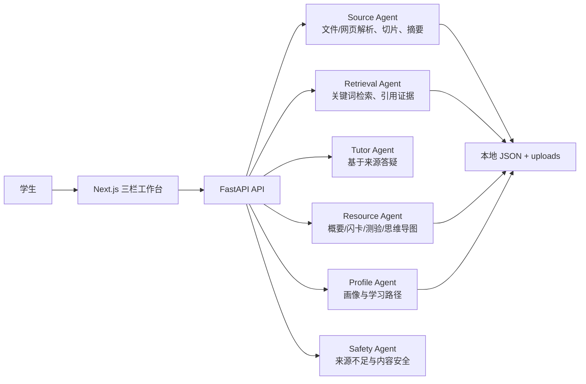

# 系统架构说明

## V1 架构

## 多智能体职责

- Supervisor Agent：V1 由 API 路由隐式调度，V2 可迁移到 LangGraph 显式图。
- Source Agent：解析文件和网页，生成切片、关键词、来源摘要。
- Retrieval Agent：从来源切片中检索证据，返回可引用片段。
- Tutor Agent：基于证据回答问题。
- Resource Agent：生成概要、闪卡、测验、思维导图、问答卡片、拓展阅读。
- Profile Agent：根据聊天、测验、闪卡反馈维护学习画像。
- Safety Agent：处理来源不足、引用缺失和内容安全。
- Evaluation Agent：当前体现在测验报告与闪卡总结中。

## 防幻觉策略

- 回答必须经过 Retrieval Agent 获取来源片段。
- 没有引用时返回“当前来源不足”，引导上传或搜索。
- 聊天输出展示来源标题和片段位置。
- 测验、闪卡、思维导图均从来源关键词和片段生成。

## V2 技术演进

- 使用 LangGraph 显式编排多智能体节点和状态转移。
- 使用 PostgreSQL + pgvector 保存课程、来源、切片、向量、画像和学习事件。
- 使用 LiteLLM 或 OpenAI-compatible gateway 管理多模型供应商。
- 使用 PaddleOCR 完成图片、扫描课件和截图题目的 OCR。
- 接入云南大学智慧教育平台的课程目录和章节资料。

