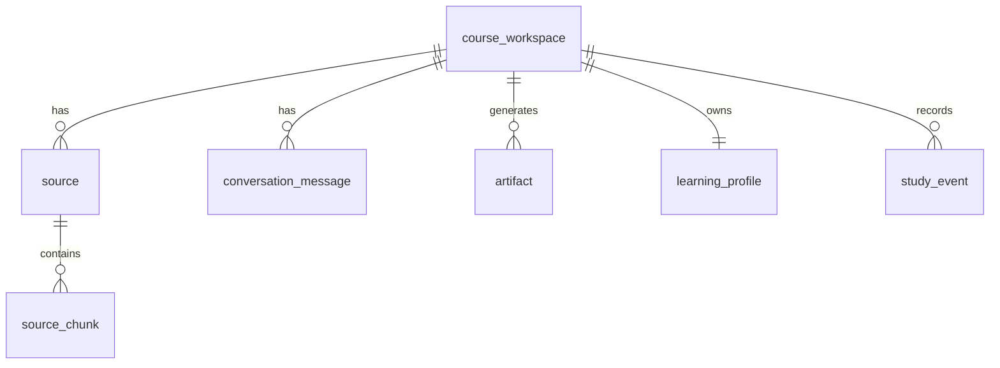

# PostgreSQL + pgvector V2 迁移说明

V1 使用本地 JSON，目的是让演示原型在没有数据库和模型 key 的情况下也能完整运行。

V2 迁移建议：

核心表：

- `course_workspace`：课程工作区。
- `source`：文件或网页来源。
- `source_chunk`：来源切片，包含 `embedding vector(...)`。
- `conversation_message`：对话历史和引用。
- `artifact`：概要、闪卡、测验、思维导图等生成物。
- `learning_profile`：学生画像。
- `study_event`：测验、闪卡、查看来源、追问等行为。

检索策略：

- MVP：pgvector 相似度检索 + 关键词过滤。
- 增强：加入 BM25/全文检索、rerank、引用一致性校验。

