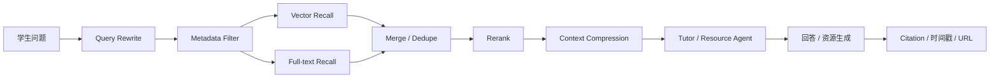

# 知识库实现与优化方案

## 1. 目标

本项目的知识库不采用“把大段资料直接塞进 prompt”的方式，而采用外部可检索知识库。课堂录播转写、课件、网页和生成资源先被解析、切片、标注 metadata，再在用户提问时按需检索少量高相关证据进入上下文。

下一阶段目标：

- 保留当前 JSON 演示数据兼容能力。
- 将核心知识库迁移到 `PostgreSQL + pgvector + PostgreSQL full-text search`。
- 对课程转写和网络搜索来源分别设计 metadata。
- 支持混合检索、重排、上下文压缩和可追溯引用。
- 让 Agent 在低上下文占用下利用大规模课程资料。

## 2. 当前实现状态

当前项目已经具备知识库雏形：

- `Source`：表示文件、网页、种子知识库、云大学堂课堂转写等来源。
- `SourceChunk`：表示来源切片，包含正文、位置、关键词、metadata。
- `Citation`：表示回答引用，包含来源、位置、片段和扩展 metadata。
- `LearningProfile`：表示学生画像，包括知识基础、学习目标、薄弱点、学习偏好、正确率、学习节奏等。
- `study_events`：记录聊天、测验、闪卡、资源生成、课程导入等学习事件。

已实现能力：

- 文件和网页来源导入、解析、切片。
- 网络搜索候选导入，保存 URL、domain、抓取状态和来源摘要。
- 云大学堂课堂转写导入，按时间轴切片。
- 课堂引用 metadata 支持 `start_time`、`end_time`、`start_seconds`、`end_seconds`、`video_url`、`source_url`。
- 聊天回答可返回 citation；课堂 citation 可点击打开本页视频弹窗并跳转到对应时间点。
- 对话历史通过 conversation summary 压缩，避免长期对话无限进入上下文。
- 课堂 chunk 在注入 prompt 时进行更短截断，避免长转写占用过多上下文。

当前限制：

- 存储仍以本地 JSON 为主，不适合真实多用户和高并发。
- 检索仍是轻量关键词/规则检索，还不是正式 embedding 检索。
- 尚未实现 PostgreSQL 全文检索、向量召回、rerank、检索评测。
- 网络来源质量分层较基础，还缺可信度评分和检索调参面板。

## 3. 参考方案

主流 RAG 和 Agent 知识库方案的共同点是：资料不直接常驻 prompt，而是外部存储、按需检索。

- LangChain 将语义检索拆成 `Documents`、`Text splitters`、`Embeddings`、`Vector stores`、`Retrievers`，适合本项目的来源切片和向量检索升级。参考：[LangChain Knowledge Base](https://docs.langchain.com/oss/python/langchain/knowledge-base)
- LlamaIndex 将检索分为 retriever 取回 context，再由 response synthesizer 基于取回片段生成回答，适合本项目的问答和资源生成流程。参考：[LlamaIndex Retriever](https://developers.llamaindex.ai/python/framework/module_guides/querying/retriever/)
- Dify 的知识库支持向量检索、全文检索、混合检索、Top K、Score Threshold、Rerank 和引用来源，适合本项目的产品化配置方向。参考：[Dify Retrieval Settings](https://docs.dify.ai/en/cloud/use-dify/knowledge/create-knowledge/setting-indexing-methods)
- RAGFlow 重视文档理解、chunk 模板、人工干预 chunk、关键词、问题和 tag，适合本项目处理课件、课堂转写和网络资料质量差异。参考：[RAGFlow Docs](https://ragflow.io/docs/)
- Haystack 将 Document Store 作为数据库接口，Retriever 和 Pipeline 串联检索与生成，适合本项目后端解耦。参考：[Haystack Document Store](https://docs.haystack.deepset.ai/docs/document-store)
- Letta / MemGPT 将常驻上下文和外部长期记忆分离，适合本项目区分学习画像、最近对话和大规模课程资料。参考：[Letta Memory Blocks](https://docs.letta.com/guides/core-concepts/memory/memory-blocks)

## 4. 目标架构



建议目标技术栈：

- 主数据库：PostgreSQL。
- 向量检索：pgvector。
- 全文检索：PostgreSQL `tsvector`，中文可结合分词扩展或业务关键词字段。
- metadata：`JSONB`。
- rerank：可选，用科大讯飞、BGE reranker 或其他兼容模型。
- 检索评测：保存问题、召回结果、人工判断、点击 citation、视频回放等事件。

## 5. 数据模型设计

建议核心表：

```text
course_workspace
source
source_chunk
source_chunk_embedding
conversation_message
artifact
learning_profile
study_event
```

### `course_workspace`

```text
id
course_title
course_code
owner_id
created_at
updated_at
metadata JSONB
```

用途：承载一门课程的来源、对话、生成物、学生画像和学习事件。

### `source`

```text
id
workspace_id
title
kind                       -- file / web / seed / lecture
status                     -- queued / parsing / chunking / vectorizing / ready / failed
summary
path
url
error
extraction_status          -- complete / partial / fallback / failed / unknown
extraction_method          -- file / jina_reader / trafilatura / html_fallback / search_snippet / ynu_transcript
content_length
metadata JSONB
created_at
updated_at
```

用途：保存来源级信息和解析质量。课堂录播、网络搜索、课件文件都统一进入 `source`。

### `source_chunk`

```text
id
workspace_id
source_id
source_title
text
summary
keywords TEXT[]
location
page_no
chunk_index
token_count
metadata JSONB
content_tsvector
created_at
updated_at
```

用途：保存可检索的最小证据单元。`metadata` 对不同来源保留不同字段。

### `source_chunk_embedding`

```text
chunk_id
embedding vector(...)
embedding_model
embedding_dim
created_at
```

用途：将正文向量与 chunk 分离，便于后续更换 embedding 模型或重建索引。

### `conversation_message`

```text
id
workspace_id
role
content
citations JSONB
created_at
metadata JSONB
```

用途：保存对话历史和引用。长期上下文仍通过摘要压缩，不把所有历史都注入 prompt。

### `learning_profile`

```text
workspace_id
knowledge_base
learning_goal
weak_points JSONB
preferred_resources JSONB
accuracy_rate
learning_pace
error_patterns JSONB
interests JSONB
next_steps JSONB
updated_at
```

用途：作为短上下文常驻信息，而不是完整学习事件日志。

### `study_event`

```text
id
workspace_id
event_type
payload JSONB
created_at
```

用途：记录导入、追问、点击 citation、播放课堂片段、测验提交、闪卡复习等行为，为学习评估和推荐提供数据。

## 6. 课程转写入库方案

课堂转写是本项目最有特色的来源类型。它不应只作为长文本存储，而应作为“带时间轴的视频知识库”。

### 来源级 metadata

```json
{
  "platform": "ynu_course",
  "course_id": "...",
  "record_id": "...",
  "course_name": "计算机网络",
  "teacher": "...",
  "school_year": "2025-2026",
  "semester": "春季",
  "week": "第 1 周",
  "section": "第 1-2 节",
  "video_url": "...",
  "source_url": "...",
  "transcript_quality": "complete"
}
```

### chunk 级 metadata

```json
{
  "kind": "lecture",
  "platform": "ynu_course",
  "week": "第 1 周",
  "section": "第 1-2 节",
  "start_time": "00:03:47",
  "end_time": "00:06:06",
  "start_seconds": 227,
  "end_seconds": 366,
  "video_url": "...",
  "source_url": "..."
}
```

### 切片策略

- 按转写时间顺序聚合字幕句子。
- 每个 chunk 控制在约 `500-900` 中文字。
- chunk 不跨越过长时间段，优先保留自然讲解段落。
- 每个 chunk 必须保留起止时间。
- 若后续引入章节目录，可将 chunk 绑定到课程章节和知识点。

### 回答行为

当检索结果来自课堂来源时，citation 应返回：

- 来源标题。
- 周次、节次。
- 起止时间。
- 精简 snippet。
- 可播放视频 URL。

前端点击 citation 后在本页弹窗打开视频，跳转到 `start_seconds`，播放到 `end_seconds` 后自动关闭。若没有直链视频，则退化为打开原录播页面。

## 7. 网络搜索来源入库方案

网络来源用于补充课程材料，但需要更强质量控制。

### 来源级 metadata

```json
{
  "domain": "example.edu.cn",
  "source_provider": "searxng",
  "crawl_method": "jina_reader",
  "quality": "complete",
  "credibility": "medium",
  "import_query": "TCP 拥塞控制",
  "fetched_at": "2026-06-29T00:00:00+08:00"
}
```

### chunk 级 metadata

```json
{
  "kind": "web",
  "url": "...",
  "domain": "...",
  "section_title": "...",
  "heading_path": ["TCP", "拥塞控制"],
  "page_no": null
}
```

### 质量策略

- `complete`：正文抽取完整，可用于重点引用。
- `partial`：正文较短或结构不完整，可用于补充。
- `fallback`：仅搜索摘要或 HTML 兜底，回答时降低权重。
- `failed`：不进入检索。

网络来源在回答中应与课堂来源区分：

- 课堂来源：优先显示时间戳和视频回放。
- 网络来源：优先显示标题、URL、网页位置、snippet。

## 8. 检索流程

建议完整流程：

```text
用户问题
-> query rewrite，结合课程、画像、最近对话
-> metadata filter，限定 workspace、ready 来源、来源类型
-> vector recall，召回 20 条语义相关 chunk
-> full-text recall，召回 20 条关键词精确命中 chunk
-> merge / dedupe，按 chunk_id 去重
-> rerank，重排到 4-6 条
-> context compression，抽取与问题相关句子
-> prompt injection，只注入少量证据
-> LLM 生成回答
-> citation 返回 source、location、snippet、metadata
```

默认参数建议：

```text
vector_top_k = 20
full_text_top_k = 20
rerank_top_k = 4-6
lecture_chunk_prompt_budget = 600-800 chars
web_chunk_prompt_budget = 800-1200 chars
conversation_recent_budget = 5-8 turns or summary + recent messages
```

## 9. 上下文压缩策略

省 token 的关键不是少存资料，而是少注入资料。

建议策略：

- 普通概览问题优先使用 `source.summary` 和课程级摘要。
- 具体知识点问题检索原文 chunk。
- 课堂转写只注入命中的短片段，不注入整节课。
- 每个 chunk 注入前做句子级压缩，只保留与问题相关的 2-5 句。
- 对话历史使用“长期摘要 + 最近几轮”。
- 学习画像只注入关键字段：薄弱点、学习目标、偏好、下一步建议。
- citation 只注入 `source_title + location + snippet`，完整正文留在数据库。

## 10. 分阶段落地计划

### 阶段 1：补齐当前 JSON 知识库能力

- 保持现有 `WorkspaceState`、`Source`、`SourceChunk`、`Citation` 不变。
- 为所有来源补齐 metadata 规范。
- 为课堂来源、网络来源、文件来源分别设定 prompt budget。
- 增加检索日志，记录 query、命中 chunk、citation、来源类型。

### 阶段 2：引入 PostgreSQL schema

- 新建 `course_workspace`、`source`、`source_chunk`、`conversation_message`、`artifact`、`learning_profile`、`study_event`。
- 保留 JSON 导入脚本，将当前演示数据迁移进数据库。
- 后端增加 Repository 层，避免 API 直接依赖 JSON 文件。

### 阶段 3：引入 embedding 和 pgvector

- 增加 `source_chunk_embedding` 表。
- 导入来源后异步计算 embedding。
- 检索时先实现 vector recall。
- 保留当前关键词检索作为 fallback。

### 阶段 4：混合检索和 metadata filter

- 加入 PostgreSQL full-text search。
- 根据 workspace、课程、来源类型、质量状态、时间范围过滤。
- 合并 vector 和 full-text 结果。
- 课堂问题优先召回 lecture 来源，通用扩展问题允许召回 web 来源。

### 阶段 5：rerank、压缩和评测

- 加入 rerank 模型，将候选从 40 条压到 4-6 条。
- 对长 chunk 做句子级上下文压缩。
- 建立检索测试集：问题、期望来源、期望时间戳、期望 URL。
- 记录 citation 点击率、视频播放完成率、回答满意度。

## 11. 验收标准

功能验收：

- 用户问课堂讲过的问题时，回答能返回课堂来源和具体时间戳。
- 点击课堂 citation 能在本页播放对应片段。
- 用户问网络补充问题时，回答能返回网页标题、URL 和 snippet。
- 长课堂转写不会整体进入 prompt。
- Top K 可配置，默认控制在 4-6 条最终证据。
- 来源不足时，回答明确标注“以下为通用解释”。

工程验收：

- 数据库 schema 支持多 workspace。
- 所有 source 和 chunk 都有稳定 id。
- chunk embedding 可重建，不影响原文。
- 检索流程可记录日志并复现。
- JSON 演示数据可迁移。

答辩验收：

- 能说明本项目不是简单调用大模型，而是具备知识库检索、上下文管理和可追溯引用能力。
- 能展示课堂转写时间戳回放这一差异化功能。
- 能说明课程来源和网络来源如何共同支持个性化资源生成。

